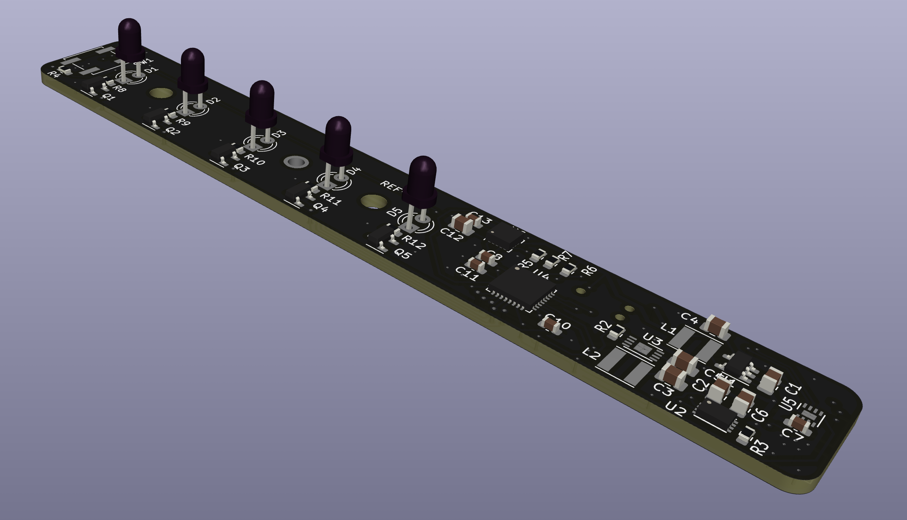

# Bike beacon fw
This repository contains the fw for the bike beacon. It is a personnal project that aims to address multiples issues I have had with bike lights until now, namely:
* forgetting to turn the light off, and thus draining the battery
* forgetting the light on the bike, and thus losing it
* having to change the batteries every 2 weeks (or less)

With this beacon, I hope to address these issues by:
* having a light that turns off automatically after a certain amount of time with no movement
* having the light embedded in the seatpost of the bike, so that it is always with the bike and cannot be removed easily
* having enough battery life to last much much more than 2 weeks.

## Hardware
The hardware is based on the following components:
* STM32l052 (ARM Cortex M0+, low power)
* LIS3DH (3 axis accelerometer)
* MAX17048G (fuel gauge)
* MC34673 charger for Li-ion battery

The hardware is designed in KiCad, and the schematics are available in the [`bike-beacon-hw`](https://github.com/allexoll/bike-beacon-hw) repository.

The board is intended to be used in an emptied-out Lightskin seatpost (https://www.lightskin.org/#specs-post). The board is designed to fit in the seatpost, and the battery is placed in the seatpost tube towards the pedals. Under the saddle is a magnetic connector to allow charging without removing the seatpost. image: 

## Performance
when off, the system consumes 70uA on the battery, allowing for long battery life. depending on the light pattern used, it consumes between 2.5 mA and 7.5 mA.